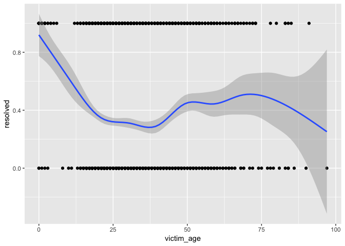

p8105\_hw6\_dk2759
================
Darwin Keung
11/25/2018

<http://p8105.com/homework_6.html>

|                                                                                                                                                                                                                                                                                                                                                                           |
| ------------------------------------------------------------------------------------------------------------------------------------------------------------------------------------------------------------------------------------------------------------------------------------------------------------------------------------------------------------------------- |
| Homework 6 Context This assignment reinforces ideas in Linear Models.                                                                                                                                                                                                                                                                                                     |
| Due date Due: November 27 at 11:00pm.                                                                                                                                                                                                                                                                                                                                     |
| Points Problem 0: 20 points Problem 1: 30 points Problem 2: 50 points Problem 0 This “problem” focuses on structure of your submission, especially the use git and GitHub for reproducibility, R Projects to organize your work, R Markdown to write reproducible reports, relative paths to load data from local files, and reasonable naming structures for your files. |
| To that end:                                                                                                                                                                                                                                                                                                                                                              |
| create a public GitHub repo + local R Project for this assignment write solutions using a .Rmd file that outputs a github\_document / .md file submit a link to your repo via Courseworks Your solutions to Problems 1 and 2 should be implemented in your .Rmd file, and your git commit history should reflect the process you used to solve these Problems.            |
| For Problem 0, we will assess adherence to the instructions above regarding repo structure, git commit history, and whether we are able to knit your .Rmd to ensure that your work is reproducible. Adherence to appropriate styling and clarity of code will be assessed in Problems 1+ using the homework style rubric.                                                 |
| This homework includes figures; the readability of your embedded plots (e.g. font sizes, axis labels, titles) will be assessed in Problems 1+.                                                                                                                                                                                                                            |
| \#\# Problem 1                                                                                                                                                                                                                                                                                                                                                            |
| The *Washington Post* has gathered data on homicides in 50 large U.S. cities and made the data available through a GitHub repository [here](https://github.com/washingtonpost/data-homicides). You can read their accompanying article [here](https://www.washingtonpost.com/graphics/2018/investigations/where-murders-go-unsolved/).                                    |

#### Data import and cleaning

Created city\_state variable (e.g. “Baltimore, MD”), and a binary
variable indicating whether the homicide is solved. Omitted cities
Dallas, TX; Phoenix, AZ; and Kansas City, MO – these don’t report victim
race. Also omitted Tulsa, AL – this is a data entry mistake. Modifiy
victim\_race to have categories white and non-white, with white as the
reference category. Be sure that victim\_age is
numeric.

``` r
homicide_df = read_csv("https://raw.githubusercontent.com/washingtonpost/data-homicides/master/homicide-data.csv", col_names = TRUE) %>%
  janitor::clean_names() %>% 
  mutate(city_state = str_c(city, ",", "", state),
         solved = if_else(disposition == "Closed by arrest", "resolved", "unresolved"),
         solved = fct_relevel(solved, "unresolved"),
         victim_age = as.numeric(victim_age),
         victim_race = tolower(victim_race),
         victim_race = ifelse(victim_race == "white", "white", "non-white"),
         victim_race = fct_relevel(victim_race, "white")) %>%
  filter(!(city_state %in% c("Dallas, TX", "Phoenix, AZ", "Kansas City, MO", "Tulsa, AL")))
```

    ## Parsed with column specification:
    ## cols(
    ##   uid = col_character(),
    ##   reported_date = col_integer(),
    ##   victim_last = col_character(),
    ##   victim_first = col_character(),
    ##   victim_race = col_character(),
    ##   victim_age = col_character(),
    ##   victim_sex = col_character(),
    ##   city = col_character(),
    ##   state = col_character(),
    ##   lat = col_double(),
    ##   lon = col_double(),
    ##   disposition = col_character()
    ## )

    ## Warning in evalq(as.numeric(victim_age), <environment>): NAs introduced by
    ## coercion

The homicide dataset contains data collected from 50 big US cities over
the a decade. It has 52179 rows and 14 columns. The variables include a
unique id, report date, first and last names of victims, age, sex, race,
location (city, state, lat, long), and disposition.

Create a city\_state variable (e.g. “Baltimore, MD”), and a binary
variable indicating whether the homicide is solved. Omit cities Dallas,
TX; Phoenix, AZ; and Kansas City, MO – these don’t report victim race.
Also omit Tulsa, AL – this is a data entry mistake. Modifiy victim\_race
to have categories white and non-white, with white as the reference
category. Be sure that victim\_age is numeric.

For the city of Baltimore, MD, use the glm function to fit a logistic
regression with resolved vs unresolved as the outcome and victim age,
sex and race (as just defined) as predictors. Save the output of glm as
an R object; apply the broom::tidy to this object; and obtain the
estimate and confidence interval of the adjusted odds ratio for solving
homicides comparing non-white victims to white victims keeping all other
variables fixed.

Now run glm for each of the cities in your dataset, and extract the
adjusted odds ratio (and CI) for solving homicides comparing non-white
victims to white victims. Do this within a “tidy” pipeline, making use
of purrr::map, list columns, and unnest as necessary to create a
dataframe with estimated ORs and CIs for each city.

Create a plot that shows the estimated ORs and CIs for each city.
Organize cities according to estimated OR, and comment on the plot.

Problem 2 In this probelm, you will analyze data gathered to understand
the effects of several variables on a child’s birthweight. This dataset,
available here, consists of roughly 4000 children and includes the
following variables:

babysex: baby’s sex (male = 1, female = 2) bhead: baby’s head
circumference at birth (centimeters) blength: baby’s length at birth
(centimeteres) bwt: baby’s birth weight (grams) delwt: mother’s weight
at delivery (pounds) fincome: family monthly income (in hundreds,
rounded) frace: father’s race (1= White, 2 = Black, 3 = Asian, 4 =
Puerto Rican, 8 = Other, 9 = Unknown) gaweeks: gestational age in weeks
malform: presence of malformations that could affect weight (0 = absent,
1 = present) menarche: mother’s age at menarche (years) mheigth:
mother’s height (inches) momage: mother’s age at delivery (years)
mrace: mother’s race (1= White, 2 = Black, 3 = Asian, 4 = Puerto Rican,
8 = Other) parity: number of live births prior to this pregnancy
pnumlbw: previous number of low birth weight babies pnumgsa: number of
prior small for gestational age babies ppbmi: mother’s pre-pregnancy BMI
ppwt: mother’s pre-pregnancy weight (pounds) smoken: average number of
cigarettes smoked per day during pregnancy wtgain: mother’s weight gain
during pregnancy (pounds) Load and clean the data for regression
analysis (i.e. convert numeric to factor where appropriate, check for
missing data, etc.).

Propose a regression model for birthweight. This model may be based on a
hypothesized structure for the factors that underly birthweight, on a
data-driven model-building process, or a combination of the two.
Describe your modeling process and show a plot of model residuals
against fitted values – use add\_predictions and add\_residuals in
making this plot.

Compare your model to two others:

One using length at birth and gestational age as predictors (main
effects only) One using head circumference, length, sex, and all
interactions (including the three-way interaction) between these Make
this comparison in terms of the cross-validated prediction error; use
crossv\_mc and functions in purrr as appropriate.

Note that although we expect your model to be reasonable, model building
itself is not a main idea of the course and we don’t necessarily expect
your model to be “optimal”.

-----

#### Data import

Describe the raw data:

These data have 52179 rows and 14 columns. The variables include a
unique id, report date, first and last names of victims, age, sex, race,
location (city, state, lat, long), and disposition.

### Binary outcome

Extract data

``` r
baltimore_df = 
  read_csv("https://raw.githubusercontent.com/washingtonpost/data-homicides/master/homicide-data.csv") %>% 
  filter(city == "Baltimore") %>% 
  mutate(resolved = as.numeric(disposition == "Closed by arrest"),
         victim_age = as.numeric(victim_age),
         victim_race = fct_relevel(victim_race, "White")) %>% 
  select(resolved, victim_age, victim_race, victim_sex)
```

    ## Parsed with column specification:
    ## cols(
    ##   uid = col_character(),
    ##   reported_date = col_integer(),
    ##   victim_last = col_character(),
    ##   victim_first = col_character(),
    ##   victim_race = col_character(),
    ##   victim_age = col_character(),
    ##   victim_sex = col_character(),
    ##   city = col_character(),
    ##   state = col_character(),
    ##   lat = col_double(),
    ##   lon = col_double(),
    ##   disposition = col_character()
    ## )

Fit the model

``` r
fit_logistic = 
  glm(resolved ~ victim_age + victim_race, 
    data = baltimore_df, 
    family = binomial())
```

Summarize fit

``` r
summary(fit_logistic)
```

    ## 
    ## Call:
    ## glm(formula = resolved ~ victim_age + victim_race, family = binomial(), 
    ##     data = baltimore_df)
    ## 
    ## Deviance Residuals: 
    ##     Min       1Q   Median       3Q      Max  
    ## -1.4651  -0.9209  -0.8935   1.4467   1.6433  
    ## 
    ## Coefficients:
    ##                      Estimate Std. Error z value Pr(>|z|)    
    ## (Intercept)          0.535470   0.206039   2.599  0.00935 ** 
    ## victim_age          -0.006147   0.003260  -1.886  0.05933 .  
    ## victim_raceAsian     0.242438   0.648110   0.374  0.70835    
    ## victim_raceBlack    -1.026360   0.169652  -6.050 1.45e-09 ***
    ## victim_raceHispanic -0.449746   0.311939  -1.442  0.14937    
    ## victim_raceOther    -1.028579   0.881681  -1.167  0.24337    
    ## ---
    ## Signif. codes:  0 '***' 0.001 '**' 0.01 '*' 0.05 '.' 0.1 ' ' 1
    ## 
    ## (Dispersion parameter for binomial family taken to be 1)
    ## 
    ##     Null deviance: 3676  on 2826  degrees of freedom
    ## Residual deviance: 3631  on 2821  degrees of freedom
    ## AIC: 3643
    ## 
    ## Number of Fisher Scoring iterations: 4

Summarize fit

``` r
fit_logistic %>% 
  broom::tidy() %>% 
  mutate(OR = boot::inv.logit(estimate)) %>% 
  knitr::kable(digits = 3)
```

| term                 | estimate | std.error | statistic | p.value |    OR |
| :------------------- | -------: | --------: | --------: | ------: | ----: |
| (Intercept)          |    0.535 |     0.206 |     2.599 |   0.009 | 0.631 |
| victim\_age          |  \-0.006 |     0.003 |   \-1.886 |   0.059 | 0.498 |
| victim\_raceAsian    |    0.242 |     0.648 |     0.374 |   0.708 | 0.560 |
| victim\_raceBlack    |  \-1.026 |     0.170 |   \-6.050 |   0.000 | 0.264 |
| victim\_raceHispanic |  \-0.450 |     0.312 |   \-1.442 |   0.149 | 0.389 |
| victim\_raceOther    |  \-1.029 |     0.882 |   \-1.167 |   0.243 | 0.263 |

``` r
baltimore_df %>% 
  ggplot(aes(x = victim_age, y = resolved)) + geom_point() + geom_smooth()
```

    ## `geom_smooth()` using method = 'gam' and formula 'y ~ s(x, bs = "cs")'

<!-- -->
