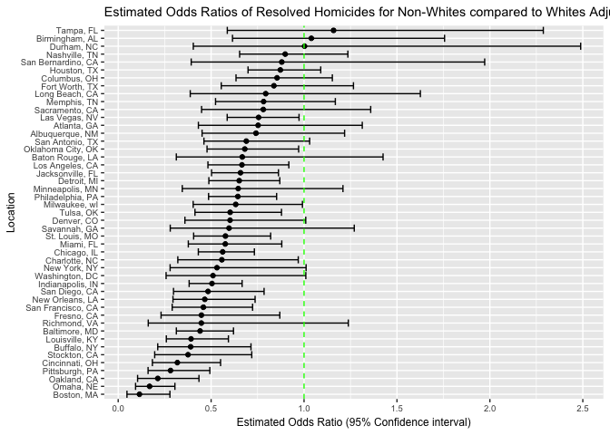

p8105\_hw6\_dk2759
================
Darwin Keung
11/25/2018

<http://p8105.com/homework_6.html>

|                                                                                                                                                                                                                                                                                                                                        |
| -------------------------------------------------------------------------------------------------------------------------------------------------------------------------------------------------------------------------------------------------------------------------------------------------------------------------------------- |
| Homework 6 Context This assignment reinforces ideas in Linear Models.                                                                                                                                                                                                                                                                  |
| \#\# Problem 1                                                                                                                                                                                                                                                                                                                         |
| The *Washington Post* has gathered data on homicides in 50 large U.S. cities and made the data available through a GitHub repository [here](https://github.com/washingtonpost/data-homicides). You can read their accompanying article [here](https://www.washingtonpost.com/graphics/2018/investigations/where-murders-go-unsolved/). |

#### Data import and cleaning

``` r
homicide_df = read_csv("https://raw.githubusercontent.com/washingtonpost/data-homicides/master/homicide-data.csv") %>% 
  janitor::clean_names() %>% 
  mutate(city_state = str_c(city, ",", " ", state), 
         resolved = as.numeric(disposition == "Closed by arrest"), 
         victim_age = as.numeric(victim_age),
         victim_race = ifelse(victim_race == "White", "White", "Non-White"), 
         victim_race = fct_relevel(victim_race, "White")) %>% 
  filter(!(city_state %in% c("Dallas, TX", "Phoenix, AZ", "Kansas City, MO", "Tulsa, AL"))) %>% 
  select(city_state, resolved, victim_age, victim_race, victim_sex)
```

    ## Parsed with column specification:
    ## cols(
    ##   uid = col_character(),
    ##   reported_date = col_integer(),
    ##   victim_last = col_character(),
    ##   victim_first = col_character(),
    ##   victim_race = col_character(),
    ##   victim_age = col_character(),
    ##   victim_sex = col_character(),
    ##   city = col_character(),
    ##   state = col_character(),
    ##   lat = col_double(),
    ##   lon = col_double(),
    ##   disposition = col_character()
    ## )

    ## Warning in evalq(as.numeric(victim_age), <environment>): NAs introduced by
    ## coercion

The homicide dataset contains data collected from 50 big US cities over
the a decade. It has 48507 rows and 5 columns. Created city\_state
variable (e.g. “Baltimore, MD”), and a binary variable indicating
whether the homicide is solved. Omitted cities Dallas, TX; Phoenix, AZ;
and Kansas City, MO – these don’t report victim race. Also omitted
Tulsa, AL – this is a data entry mistake. Modified victim\_race to have
categories white and non-white, with white as the reference category.
victim\_age is numeric. The variables also include a unique id, report
date, first and last names of victims, age, sex, race, location (city,
state, lat, long), and disposition.

### glm Baltimore

For the city of Baltimore, MD, use the `glm` function to fit a logistic
regression with resolved vs unresolved as the outcome and victim age,
sex and race (as just defined) as predictors.

``` r
fit_logr_baltimore = 
  homicide_df %>% 
  filter(city_state == "Baltimore, MD") %>% 
  glm(resolved ~ victim_age + victim_race + victim_sex, 
      data = ., 
      family = binomial())
fit_logr_baltimore %>% 
  broom::tidy() %>% 
  janitor::clean_names() %>% 
  filter(term == "victim_raceNon-White") %>% 
  mutate(OR = exp(estimate), 
         lower_95ci = exp(estimate - 1.96*std_error), 
         upper_95ci = exp(estimate + 1.96*std_error)) %>%
  select(OR, lower_95ci, upper_95ci) %>% 
  knitr::kable(digits = 3)
```

|    OR | lower\_95ci | upper\_95ci |
| ----: | ----------: | ----------: |
| 0.441 |       0.313 |        0.62 |

The adjusted odd ratio of resolving the homicide case for non-white
victims compared to white victims after adjusting for age and sex are
0.441 (95% CI: 0.313, 0.620).

### glm for each city

Now run glm for each of the cities in your dataset, and extract the
adjusted odds ratio (and CI) for solving homicides comparing non-white
victims to white victims. Do this within a “tidy” pipeline, making use
of purrr::map, list columns, and unnest as necessary to create a
dataframe with estimated ORs and CIs for each city.

``` r
fit_logr_cities = homicide_df %>% 
  group_by(city_state) %>%
  nest() %>% 
  mutate(models = map(.x = data, ~ glm(resolved ~ victim_sex + victim_race + victim_age, data = .x,
                                      family = binomial)),
         models = map(models, broom::tidy)) %>% 
  select(-data) %>% 
  unnest() %>%
  janitor::clean_names() %>% 
  filter(term == "victim_raceNon-White") %>%
  mutate(OR = exp(estimate), 
         lower_95ci = exp(estimate - 1.96*std_error), 
         upper_95ci = exp(estimate + 1.96*std_error)) %>%
  select(city_state, OR, lower_95ci, upper_95ci)
#table of cities with OR and CI
fit_logr_cities %>% 
  knitr::kable(digits = 3)
```

| city\_state        |    OR | lower\_95ci | upper\_95ci |
| :----------------- | ----: | ----------: | ----------: |
| Albuquerque, NM    | 0.741 |       0.451 |       1.218 |
| Atlanta, GA        | 0.753 |       0.432 |       1.313 |
| Baltimore, MD      | 0.441 |       0.313 |       0.620 |
| Baton Rouge, LA    | 0.668 |       0.313 |       1.425 |
| Birmingham, AL     | 1.039 |       0.615 |       1.756 |
| Boston, MA         | 0.115 |       0.047 |       0.278 |
| Buffalo, NY        | 0.390 |       0.213 |       0.715 |
| Charlotte, NC      | 0.558 |       0.321 |       0.969 |
| Chicago, IL        | 0.562 |       0.431 |       0.733 |
| Cincinnati, OH     | 0.318 |       0.184 |       0.551 |
| Columbus, OH       | 0.855 |       0.634 |       1.152 |
| Denver, CO         | 0.602 |       0.359 |       1.009 |
| Detroit, MI        | 0.651 |       0.488 |       0.869 |
| Durham, NC         | 1.003 |       0.404 |       2.489 |
| Fort Worth, TX     | 0.838 |       0.555 |       1.266 |
| Fresno, CA         | 0.448 |       0.231 |       0.870 |
| Houston, TX        | 0.873 |       0.699 |       1.090 |
| Indianapolis, IN   | 0.505 |       0.382 |       0.667 |
| Jacksonville, FL   | 0.658 |       0.502 |       0.862 |
| Las Vegas, NV      | 0.755 |       0.586 |       0.973 |
| Long Beach, CA     | 0.794 |       0.388 |       1.626 |
| Los Angeles, CA    | 0.666 |       0.483 |       0.918 |
| Louisville, KY     | 0.392 |       0.259 |       0.593 |
| Memphis, TN        | 0.782 |       0.524 |       1.168 |
| Miami, FL          | 0.576 |       0.377 |       0.880 |
| Milwaukee, wI      | 0.632 |       0.403 |       0.991 |
| Minneapolis, MN    | 0.646 |       0.345 |       1.209 |
| Nashville, TN      | 0.899 |       0.653 |       1.236 |
| New Orleans, LA    | 0.466 |       0.295 |       0.737 |
| New York, NY       | 0.531 |       0.279 |       1.011 |
| Oakland, CA        | 0.213 |       0.104 |       0.435 |
| Oklahoma City, OK  | 0.681 |       0.478 |       0.971 |
| Omaha, NE          | 0.169 |       0.094 |       0.305 |
| Philadelphia, PA   | 0.644 |       0.486 |       0.852 |
| Pittsburgh, PA     | 0.282 |       0.161 |       0.493 |
| Richmond, VA       | 0.447 |       0.162 |       1.238 |
| San Antonio, TX    | 0.689 |       0.461 |       1.030 |
| Sacramento, CA     | 0.781 |       0.449 |       1.359 |
| Savannah, GA       | 0.596 |       0.280 |       1.270 |
| San Bernardino, CA | 0.880 |       0.393 |       1.972 |
| San Diego, CA      | 0.483 |       0.298 |       0.785 |
| San Francisco, CA  | 0.458 |       0.290 |       0.723 |
| St. Louis, MO      | 0.577 |       0.406 |       0.820 |
| Stockton, CA       | 0.376 |       0.196 |       0.719 |
| Tampa, FL          | 1.159 |       0.587 |       2.288 |
| Tulsa, OK          | 0.602 |       0.413 |       0.879 |
| Washington, DC     | 0.510 |       0.258 |       1.010 |

Create a plot that shows the estimated ORs and CIs for each city.
Organize cities according to estimated OR, and comment on the plot.

``` r
fit_logr_cities = fit_logr_cities %>% 
  arrange(-desc(OR)) %>% 
  mutate(city_state = fct_inorder(city_state))
  
ggplot(fit_logr_cities, aes(x = city_state, y = OR )) + 
  geom_point() + 
  geom_errorbar(aes(ymin = lower_95ci, ymax = upper_95ci)) + 
  geom_hline(aes(yintercept = 1.00), linetype = "dashed", color = "green") +
  coord_flip() +
  theme(text = element_text(size = 9)) +
  labs(
    y = "Estimated Odds Ratio (95% Confidence interval)",
    x = "Location",
    title = "Estimated Odds Ratios of Resolved Homicides for Non-Whites compared to Whites Adjusted for Age and Sex by City"
  )
```

<!-- -->

Most of the cities have an OR that crosses 1 which means there is no
statistical significance for unsolved crime for non-whites vs whites.
However for cities that have a OR less than 1, the likelihood of a
non-white victims homicide being resolved is statistically less likely
than a white victims case (see Boston, Omaha, Oakland as the 3 least
likely cities). Tampa has the highest OR, Los Vegas and Oklahoma City
have the highest ORs which a CI under 1.

### Problem 2

In this problem, you will analyze data gathered to understand the
effects of several variables on a child’s birthweight. This dataset,
available [here](http://p8105.com/data/birthweight.csv) consists of
roughly 4000 children.

``` r
birthweight_df = read_csv("http://p8105.com/data/birthweight.csv") %>% 
  janitor::clean_names() %>% 
    mutate(
      babysex = as.factor(babysex),
      frace = as.factor(frace),
      mrace = as.factor(mrace),
      malform = as.factor(malform))
```

    ## Parsed with column specification:
    ## cols(
    ##   .default = col_integer(),
    ##   gaweeks = col_double(),
    ##   ppbmi = col_double(),
    ##   smoken = col_double()
    ## )

    ## See spec(...) for full column specifications.

``` r
#any missing?
filter_all(birthweight_df, any_vars(is.na(.)))
```

    ## # A tibble: 0 x 20
    ## # ... with 20 variables: babysex <fct>, bhead <int>, blength <int>,
    ## #   bwt <int>, delwt <int>, fincome <int>, frace <fct>, gaweeks <dbl>,
    ## #   malform <fct>, menarche <int>, mheight <int>, momage <int>,
    ## #   mrace <fct>, parity <int>, pnumlbw <int>, pnumsga <int>, ppbmi <dbl>,
    ## #   ppwt <int>, smoken <dbl>, wtgain <int>

``` r
sum(is.na(birthweight_df))
```

    ## [1] 0

``` r
## no missing data.
```

Hypothesis: baby’s birthweight is associated with `menarche` mother’s
age at menarche (years) Adjust for: baby’s sex, mom’s age, mom’s race,
mom’s weight gain, mom’s bmi prepregnancy, gestational age and average
number of cigarettes smoked per day during pregnancy.

Use linear regression since the outcome of birthweight is
continous.

## Modeling my fit

``` r
model_1 = lm(bwt ~ gaweeks + babysex + momage + mrace  + wtgain + ppbmi + smoken, data = birthweight_df)

model_1 %>% 
  broom::tidy() 
```

    ## # A tibble: 10 x 5
    ##    term        estimate std.error statistic   p.value
    ##    <chr>          <dbl>     <dbl>     <dbl>     <dbl>
    ##  1 (Intercept)   515.      98.8        5.21 1.98e-  7
    ##  2 gaweeks        53.9      2.13      25.4  2.27e-132
    ##  3 babysex2      -84.5     13.0       -6.49 9.35e- 11
    ##  4 momage          2.95     1.82       1.62 1.05e-  1
    ##  5 mrace2       -290.      15.0      -19.3  8.69e- 80
    ##  6 mrace3       -139.      66.7       -2.08 3.74e-  2
    ##  7 mrace4       -182.      29.4       -6.18 6.85e- 10
    ##  8 wtgain          9.88     0.607     16.3  7.20e- 58
    ##  9 ppbmi          19.7      2.08       9.47 4.40e- 21
    ## 10 smoken        -11.5      0.907    -12.7  1.73e- 36

Plot model 1 residuals against fitted values – use add\_predictions and
add\_residuals in making this plot.

``` r
birthweight_df %>% 
  modelr::add_predictions(model_1) %>% 
  modelr::add_residuals(model_1) %>% 
  ggplot(aes(x = pred, y = resid)) + geom_point() +
  labs(x = "Predicted value", 
       y = "Residual")
```

<!-- -->

### Compare model to two others:

One using length at birth and gestational age as predictors (main
effects only)

``` r
length_age_fit = lm(bwt ~ blength + gaweeks, data = birthweight_df)
length_age_fit %>% 
  broom::tidy()
```

    ## # A tibble: 3 x 5
    ##   term        estimate std.error statistic  p.value
    ##   <chr>          <dbl>     <dbl>     <dbl>    <dbl>
    ## 1 (Intercept)  -4348.      98.0      -44.4 0.      
    ## 2 blength        129.       1.99      64.6 0.      
    ## 3 gaweeks         27.0      1.72      15.7 2.36e-54

One using head circumference, length, sex, and all interactions
(including the three-way interaction)

between these Make this comparison in terms of the cross-validated
prediction error; use crossv\_mc and functions in purrr as appropriate.

Note that although we expect your model to be reasonable, model building
itself is not a main idea of the course and we don’t necessarily expect
your model to be “optimal”.
